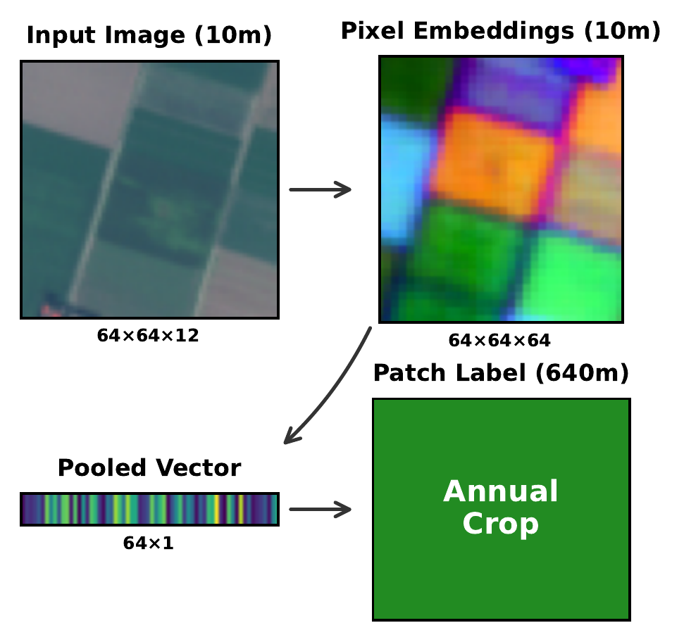

# 🏊 GeoPool: From Pixels to Patches — Pooling Strategies for Earth Embeddings

> **Accepted** at the [ICLR 2026 ML4RS Workshop](https://ml-for-rs.github.io/iclr2026/) in Rio de Janeiro, Brazil 🇧🇷

[](paper/iclr2026_conference.pdf)
[](https://huggingface.co/datasets/isaaccorley/eurosat-embed)
[](LICENSE)

Benchmark for evaluating pixel-to-patch pooling methods on geospatial foundation model embeddings.

<p align="center">
  
</p>

As geospatial foundation models shift from patch-level to pixel-level embeddings, practitioners must aggregate thousands of pixel vectors into patch representations. The default choice — mean pooling — discards within-patch variability and can drop accuracy by **>10%** under spatial shift. We benchmark **13 pooling methods** across **3 GFMs** (AlphaEarth, OlmoEarth, Tessera) on EuroSAT land-cover classification and release **EuroSAT-Embed**: 81,000 embedding GeoTIFFs for reproducible pooling research.

## 📊 Key Results

**GeM pooling** is a drop-in replacement for mean pooling: **+5% spatial accuracy** without increasing embedding dimensionality. For maximum accuracy, **Stats pooling** (min/max/mean/std) reaches peak performance at 4x the embedding size. Richer pooling schemes reduce the geographic generalization gap by up to **40%** relative to mean pooling.

<p align="center">
  
</p>

*Random vs. spatial split accuracy across encoders. Points near the diagonal generalize better under geographic shift.*

## 💡 Recommendation: Use GeM Pooling

GeM (Generalized Mean Pooling) interpolates between mean (`p=1`) and max (`p→∞`) pooling. With `p=3`, it emphasizes higher activations while preserving dimensionality — a one-line swap from `np.mean`.

**NumPy:**

```python
import numpy as np

def gem_pool(x: np.ndarray, p: float = 3.0) -> np.ndarray:
    """Generalized mean pooling over spatial dims. x: (H, W, D) -> (D,)"""
    powered = np.sign(x) * np.abs(x) ** p
    pooled = powered.mean(axis=(0, 1))
    return np.sign(pooled) * np.abs(pooled) ** (1.0 / p)
```

**PyTorch:**

```python
import torch

def gem_pool(x: torch.Tensor, p: float = 3.0) -> torch.Tensor:
    """Generalized mean pooling over spatial dims. x: (B, H, W, D) -> (B, D)"""
    powered = x.sign() * x.abs().pow(p)
    pooled = powered.mean(dim=(1, 2))
    return pooled.sign() * pooled.abs().pow(1.0 / p)
```

## 🗂️ Pooling Methods

### Training-Free

| Method | Key | Dim | Description |
|---|---|---|---|
| Mean | `mean` | D | Global average pooling |
| Max | `max` | D | Global max pooling |
| Std | `std` | D | Global standard deviation |
| GeM | `gem` | D | Generalized mean pooling (p=3) |
| Center-Weighted | `center_weighted_mean` | D | Gaussian-weighted mean (center focus) |
| Mean+Std | `mean_std` | 2D | Concatenation of mean and std |
| Mean+Max | `mean_max` | 2D | Concatenation of mean and max |
| Median+IQR | `median_iqr` | 2D | Median and interquartile range |
| Stats | `stats` | 4D | min, max, mean, std concatenated |
| Percentiles | `percentiles` | 5D | 10th, 25th, 50th, 75th, 90th percentiles |
| Covariance | `flattened_cov` | D(D+1)/2 | Upper triangle of covariance matrix |

### Parametric (require training data)

| Method | Key | Dim | Description |
|---|---|---|---|
| PCA | `pca_64` | 64 | PCA on mean-pooled embeddings |
| BoVW | `bovw_128` | 128 | Bag of Visual Words (k-means clustering) |

## ⚙️ Setup

```bash
make install
```

For the download/embed workflow, install the extra dependency group too:

```bash
uv sync --dev --group download
```

## 📦 Datasets

The dense pixel embedding variants of EuroSAT and pooled versions are on [HuggingFace](https://huggingface.co/datasets/isaaccorley/eurosat-embed).

```bash
# pooled embeddings
wget https://hf.co/datasets/isaaccorley/eurosat-embed/resolve/main/embeddings-aef-pooled.tar.gz
wget https://hf.co/datasets/isaaccorley/eurosat-embed/resolve/main/embeddings-olmoearth-nano-pooled.tar.gz
wget https://hf.co/datasets/isaaccorley/eurosat-embed/resolve/main/embeddings-olmoearth-tiny-pooled.tar.gz
wget https://hf.co/datasets/isaaccorley/eurosat-embed/resolve/main/embeddings-olmoearth-base-pooled.tar.gz
wget https://hf.co/datasets/isaaccorley/eurosat-embed/resolve/main/embeddings-tessera-pooled.tar.gz

# pixel embeddings
wget https://hf.co/datasets/isaaccorley/eurosat-embed/resolve/main/eurosat-aef.tar.gz
wget https://hf.co/datasets/isaaccorley/eurosat-embed/resolve/main/eurosat-olmoearth-nano.tar.gz
wget https://hf.co/datasets/isaaccorley/eurosat-embed/resolve/main/eurosat-olmoearth-tiny.tar.gz
wget https://hf.co/datasets/isaaccorley/eurosat-embed/resolve/main/eurosat-olmoearth-base.tar.gz
wget https://hf.co/datasets/isaaccorley/eurosat-embed/resolve/main/eurosat-tessera.tar.gz
```

## 🧪 Evaluation

Once pooled embeddings are downloaded/created in `embeddings/`:

### Run kNN and linear probes

```bash
uv run python scripts/knnprobe.py --dataset-name aef
uv run python scripts/linearprobe.py --dataset-name aef
```

### Generate paper tables

```bash
uv run python scripts/knn_table.py --output paper/knn_table.tex
uv run python scripts/linear_table.py --output paper/linear_table.tex
```

### Plot results

```bash
uv run python scripts/plot_results.py
```

## 🔧 (Optional) Generating Pixel Embeddings

All data is available on HuggingFace above. To regenerate from scratch:

### Download EuroSAT and splits

```bash
uv run python data/download_eurosat.py
```

### Create EuroSAT-AEF from Google Earth Engine (requires GEE auth)

```bash
uv run python data/download_eurosat_aef.py
uv run python data/convert_aef.py
```

### Generate EuroSAT-OlmoEarth and EuroSAT-Tessera embeddings

Install the download/embed dependency group first:

```bash
uv sync --dev --group download
```

```bash
uv run python scripts/embed_olmoearth.py --model-size nano
uv run python scripts/embed_tessera.py
```

### Cache pooled embeddings

```bash
uv run python scripts/pool.py --dataset-name aef
uv run python scripts/pool.py --dataset-name tessera
uv run python scripts/pool.py --dataset-name olmoearth-nano
uv run python scripts/pool.py --dataset-name olmoearth-tiny
uv run python scripts/pool.py --dataset-name olmoearth-base
```

If running OOM, use `scripts/pool-stream.py` which streams in batches (slower).

## 🛠️ Development

```bash
make check  # lint + format + typecheck
make test   # run tests
```

## 📝 Citation

```bibtex
@inproceedings{corley2026geopool,
  title={From Pixels to Patches: Pooling Strategies for Earth Embeddings},
  author={Corley, Isaac and Robinson, Caleb and Becker-Reshef, Inbal and Lavista Ferres, Juan M.},
  booktitle={ICLR 2026 Workshop on Machine Learning for Remote Sensing (ML4RS)},
  year={2026}
}
```
