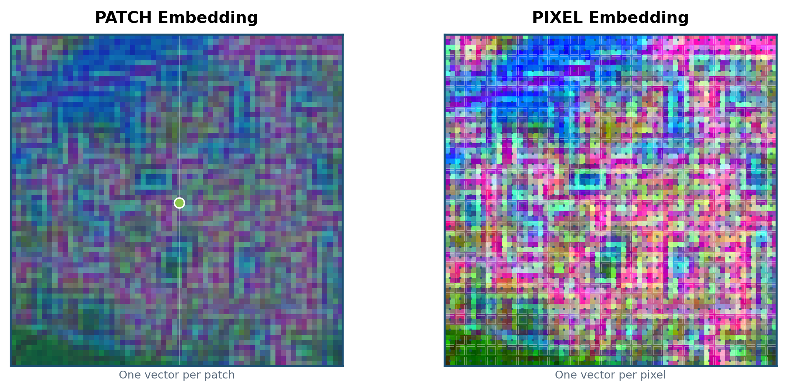
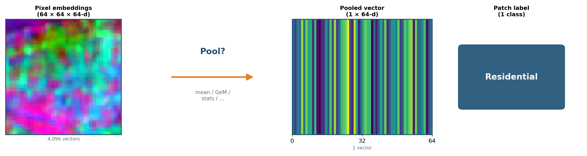
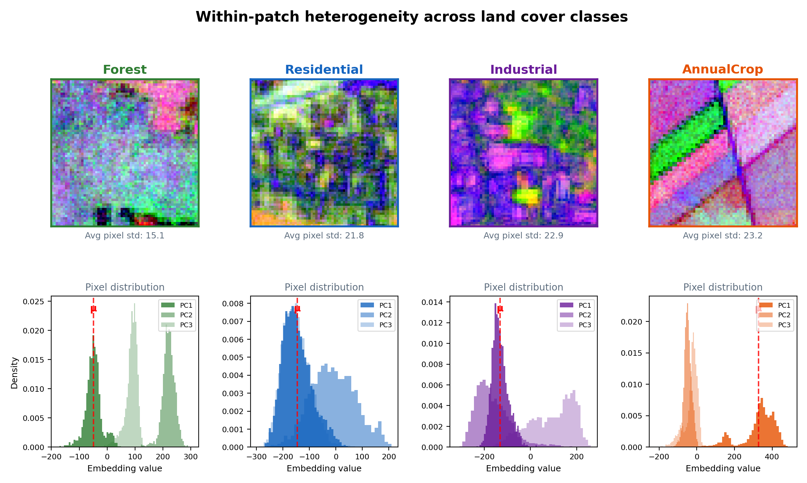
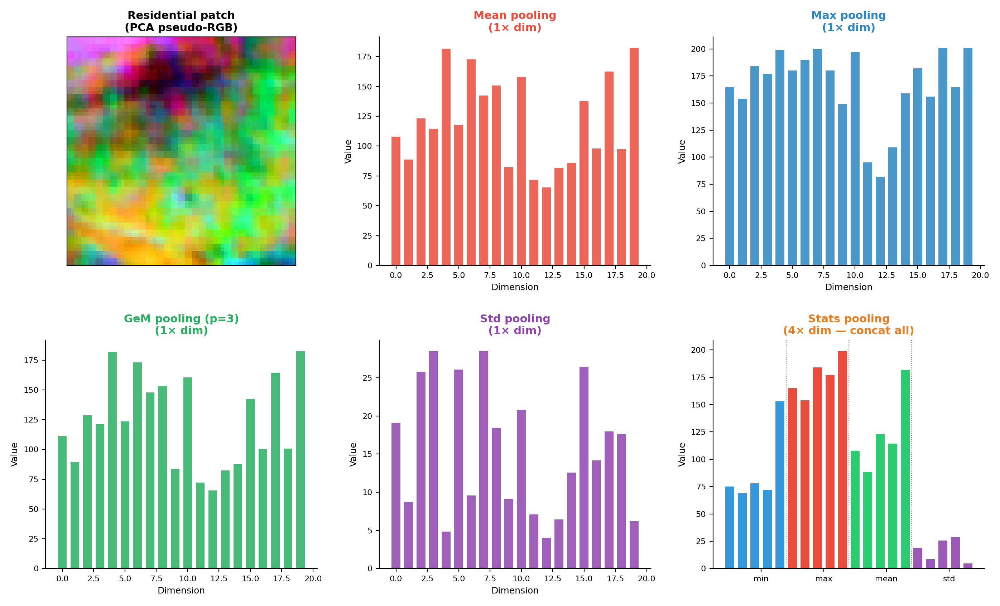
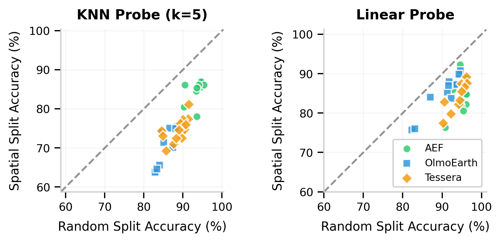
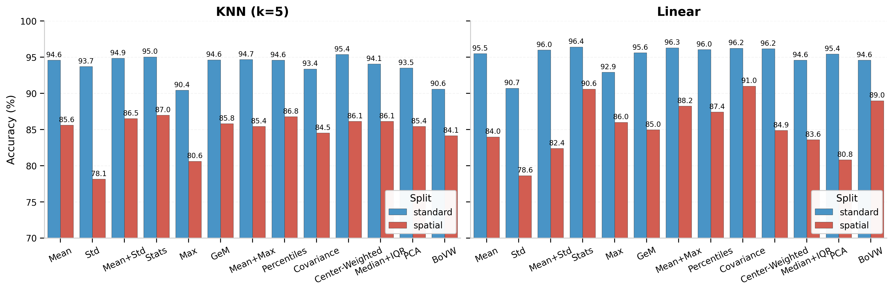
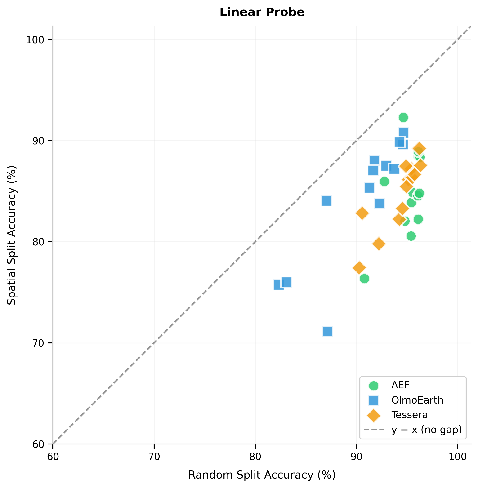

# Motivation {background-image="bg/wb4.png"}

## The resolution mismatch problem {background-image="bg/wb4.png"}

:::: {.columns}

::: {.column width="52%"}
Geospatial foundation models produce **pixel-level** embeddings (64--512 dims per pixel).

But downstream labels live at **patch / region** scale --- land cover patches, crop fields, building polygons.

**So we must pool.** The question is *how*.

The default --- mean pooling --- drops accuracy by >10% under geographic shift.
:::

::: {.column width="44%"}
{width="100%"}
:::

::::

## Patch vs. pixel embeddings {background-image="bg/wb4.png"}

::: {style="text-align: center;"}
{height="65%"}
:::

Pixel-level models produce a vector *per pixel* --- thousands of embeddings per patch that must be aggregated.

## The pooling pipeline {background-image="bg/wb4.png"}

::: {style="text-align: center;"}
{width="90%"}
:::

PCA pseudo-RGB of actual AlphaEarth embeddings (64-d). Pooling compresses 4,096 vectors into one --- the method matters.

## Pooling matters in other domains {background-image="bg/wb4.png"}

:::: {.columns}

::: {.column width="30%"}
**Image Retrieval**

GeM pooling consistently outperforms mean pooling

::: {style="font-size: 0.7em;"}
Radenović et al., 2018
:::
:::

::: {.column width="30%"}
**Audio / Video**

Stats pooling (mean+std) summarizes variable-length sequences effectively

::: {style="font-size: 0.7em;"}
Miech et al., 2017
:::
:::

::: {.column width="30%"}
**Object-Based IA**

Bag of Visual Words uses region histograms for classification

::: {style="font-size: 0.7em;"}
Csurka et al., 2004
:::
:::

::::

::: {style="text-align: center; margin-top: 1em;"}
Yet pooling is [largely unexplored]{.alert} for earth embeddings.
:::

# EuroSAT-Embed {background-image="bg/wb4.png"}

## EuroSAT-Embed: a pooling research benchmark {background-image="bg/wb4.png"}

81,000 pixel-embedding GeoTIFFs from three foundation models, aligned to EuroSAT (27k patches, 10 land-cover classes).

:::: {.columns}

::: {.column width="30%"}
**AlphaEarth**\
64-d, `int8`, 3.3 GB
:::

::: {.column width="30%"}
**OlmoEarth-Nano**\
128-d, `float32`, 40 GB
:::

::: {.column width="30%"}
**Tessera**\
512-d, `float32`, 164 GB
:::

::::

Reproducible pooling research **without re-running** expensive GFM inference.

Evaluated on **random** (i.i.d.) and **spatial** (geographically disjoint) splits.

::: {style="font-size: 0.8em;"}
`CC-BY-4.0` · [hf.co/datasets/isaaccorley/eurosat-embed](https://hf.co/datasets/isaaccorley/eurosat-embed)
:::

# Pooling Methods {background-image="bg/wb4.png"}

## First-order pooling {background-image="bg/wb4.png"}

Given $X \in \mathbb{R}^{H \times W \times D}$ with $N = HW$ pixels:

:::: {.columns}

::: {.column width="45%"}
**Mean** (baseline)
$$\mu = \frac{1}{N}\sum_i x_i$$

**Max** --- per-channel maximum
:::

::: {.column width="45%"}
**Generalized Mean (GeM)**
$$\text{GeM}_p = \left(\frac{1}{N}\sum_i x_i^{\,p}\right)^{\!1/p}$$

**Center-weighted mean** --- Gaussian kernel
:::

::::

All preserve original dimensionality (1×).

## Distributional and parametric pooling {background-image="bg/wb4.png"}

**Hypothesis:** class signal lives in the *distribution*, not just the mean.

:::: {.columns}

::: {.column width="45%"}
**Distributional (training-free):**

- Mean+Std, Mean+Max (2×)
- Median+IQR (2×)
- Stats [min/max/μ/σ] (4×)
- Percentiles [10..90] (5×)
- Covariance upper-tri
:::

::: {.column width="45%"}
**Parametric (need training data):**

- PCA --- project to lower dim
- BoVW --- $k$-means histogram

E.g., a residential patch and an industrial area can share a mean but differ wildly in variance.
:::

::::

## Within-patch heterogeneity across classes {background-image="bg/wb4.png"}

:::: {.columns}

::: {.column width="32%"}
Homogeneous classes cluster tightly; heterogeneous ones show [broad distributions]{.alert}.

Mean pooling (μ, red) misses this signal.
:::

::: {.column width="66%"}
{width="100%"}
:::

::::

## What different pooling methods capture {background-image="bg/wb4.png"}

:::: {.columns}

::: {.column width="32%"}
Same patch, different pooling outputs.

**Stats** (4× dim) captures the full distribution; mean (1×) collapses it.
:::

::: {.column width="66%"}
{width="100%"}
:::

::::

# Setup {background-image="bg/wb4.png"}

## Evaluation protocol {background-image="bg/wb4.png"}

::: {style="text-align: center;"}

```{mermaid}
%%| fig-width: 10
flowchart LR
    A["3 encoders"] --> B["13 pooling\nmethods"]
    B --> C["2 probes\nkNN | Linear"]
    C --> D["2 splits\nRandom | Spatial"]
```

:::

::: {style="text-align: center; font-size: 1.5em; font-weight: bold; margin: 0.5em 0;"}
= 156 experiments
:::

:::: {.columns}

::: {.column width="45%"}
**kNN** ($k{=}5$, cosine distance)\
Probes geometric / similarity structure
:::

::: {.column width="45%"}
**Linear** (logistic regression, L-BFGS)\
Probes linear separability
:::

::::

# Results {background-image="bg/wb4.png"}

## Distributional statistics improve generalization {background-image="bg/wb4.png"}

:::: {.columns}

::: {.column width="48%"}
Linear probe on **spatial** splits:

| Method | Accuracy |
|--------|----------|
| Mean (baseline) | 76--84% |
| Mean+Max | 87--89% |
| **Stats** | **88--91%** |

[+7--10%]{.alert} gain over mean pooling.

On random splits, differences shrink to 3--5% (spatial leakage flatters everyone).

The spatial split is the honest evaluation.
:::

::: {.column width="48%"}
{width="100%"}

::: {style="font-size: 0.8em;"}
Closer to diagonal = smaller gap
:::
:::

::::

## GeM: zero-cost upgrade {background-image="bg/wb4.png"}

:::: {.columns}

::: {.column width="50%"}
**Generalized Mean** ($p{=}3$):
$$\text{GeM} = \left(\frac{1}{N}\sum_i x_i^{\,3}\right)^{\!1/3}$$

- [+5% spatial accuracy]{.alert} over mean
- Same dimensionality (1×)
- No training, no storage overhead
- Consistent across all three encoders

Softly upweights high-activation pixels without the harsh cutoff of max pooling.
:::

::: {.column width="45%"}
{width="100%"}
:::

::::

## Accuracy--dimensionality tradeoff {background-image="bg/wb4.png"}

::: {style="text-align: center;"}
{width="60%"}
:::

:::: {.columns}

::: {.column width="30%"}
**No overhead (1×)**\
GeM (+5%)
:::

::: {.column width="30%"}
**Best tradeoff (2×)**\
Mean+Max (+6--8%)
:::

::: {.column width="30%"}
**Peak accuracy (4×)**\
Stats (+7--10%)
:::

::::

## Pooling interacts with the encoder {background-image="bg/wb4.png"}

:::: {.columns}

::: {.column width="30%"}
**AlphaEarth** (64-d)

BoVW hits 92.3% (linear) but fails on other encoders.

Compact embeddings are naturally more robust to shift.
:::

::: {.column width="30%"}
**OlmoEarth** (128-d)

Std alone boosts kNN by +11% over mean.

Second-order stats help similarity search more than linear probes.
:::

::: {.column width="30%"}
**Tessera** (512-d)

Covariance pooling excels at kNN.

Largest mean-pooling gap (12%). High-dim benefits most from stats.
:::

::::

::: {style="text-align: center; margin-top: 1em;"}
Higher embedding dimension ⟹ more benefit from distributional statistics.
:::

## Richer statistics close the generalization gap {background-image="bg/wb4.png"}

:::: {.columns}

::: {.column width="48%"}
{width="100%"}
:::

::: {.column width="48%"}
Accuracy drop (random → spatial):

| Method | Drop |
|--------|------|
| Mean | **10%** |
| Mean+Max | 6.4% |
| Stats | 6.2% |
| Max | 5.8% |

Mean pooling discards intra-patch heterogeneity that matters most under geographic shift.
:::

::::

# Takeaways {background-image="bg/wb4.png"}

## Recommendations {background-image="bg/wb4.png"}

::: {style="text-align: center;"}

| Scenario | Method | Gain | Dim |
|----------|--------|------|-----|
| Drop-in default | GeM ($p{=}3$) | +5% | 1× |
| Best accuracy | Stats [min/max/μ/σ] | +7--10% | 4× |
| Balanced | Mean+Max | +6--8% | 2× |
| kNN retrieval | Covariance / Percentiles | +3--7% | varies |

:::

All recommended methods are **training-free** and consistent across encoders.

Start with GeM. Upgrade to Stats if you can afford 4× the storage.

## Why does this work? {background-image="bg/wb4.png"}

:::: {.columns}

::: {.column width="45%"}
**The intuition**

Mean pooling collapses a patch into a single "average pixel."

A residential neighborhood and an industrial park can share a similar mean but differ in variance --- mixed rooftops, roads, vegetation vs. uniform warehouses.

Higher-order statistics preserve that heterogeneity.
:::

::: {.column width="45%"}
**Broader implications**

Extends GeM results from image retrieval to the geospatial domain.

Foundation models encode fine-grained semantic structure worth preserving.

Aggregation should be a design decision, not an afterthought.
:::

::::

## Limitations & future directions {background-image="bg/wb4.png"}

:::: {.columns}

::: {.column width="45%"}
**Limitations**

- Single benchmark (EuroSAT)
- Three embedding sources
- Fixed hyperparameters
:::

::: {.column width="45%"}
**Next steps**

- BigEarthNet, fMoW
- Learned / attention pooling
- Temporal aggregation
:::

::::

**Open resources**

- Dataset: [hf.co/datasets/isaaccorley/eurosat-embed](https://hf.co/datasets/isaaccorley/eurosat-embed)
- Code: [github.com/isaaccorley/geopool](https://github.com/isaaccorley/geopool)

## {background-color="#1B4F72"}

::: {style="text-align: center;"}

### Questions?

:::: {.columns}

::: {.column width="40%"}
{width="80%"}

Code
:::

::: {.column width="40%"}
{width="80%"}

Dataset
:::

::::

:::
